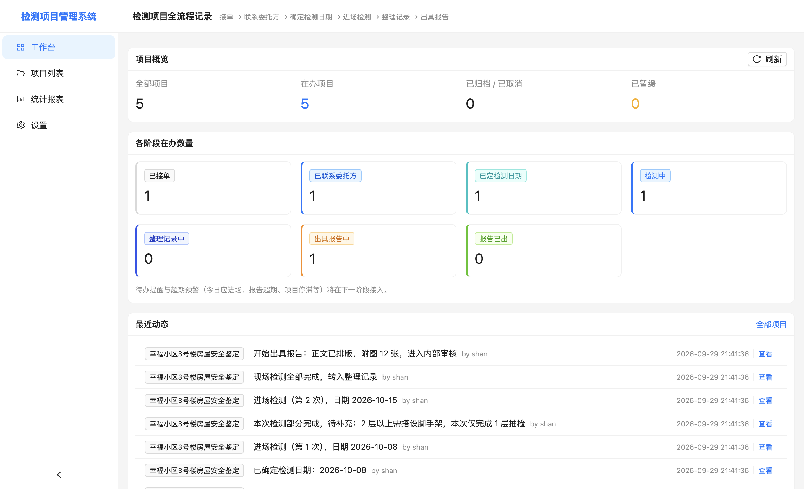
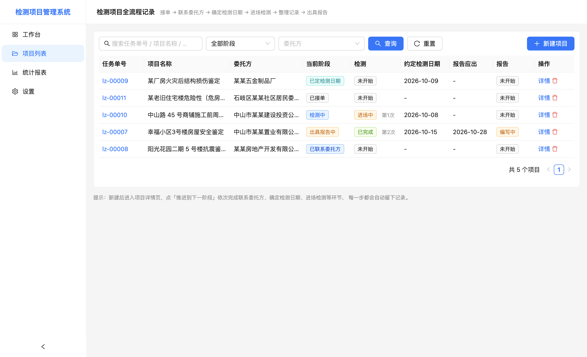
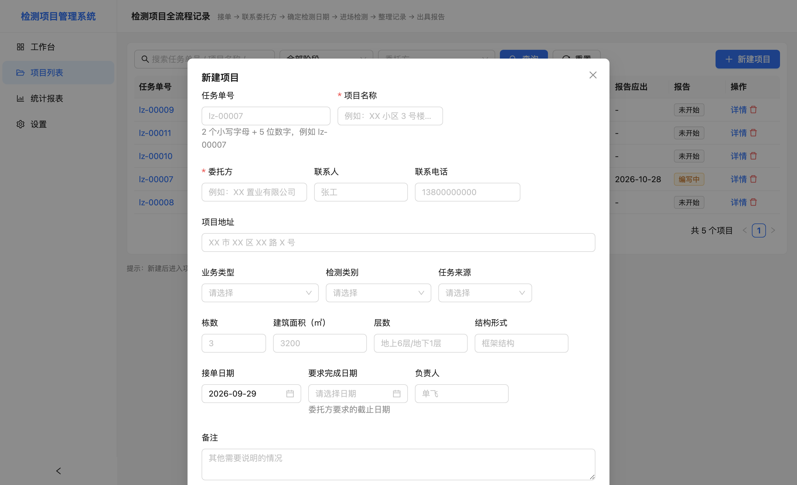
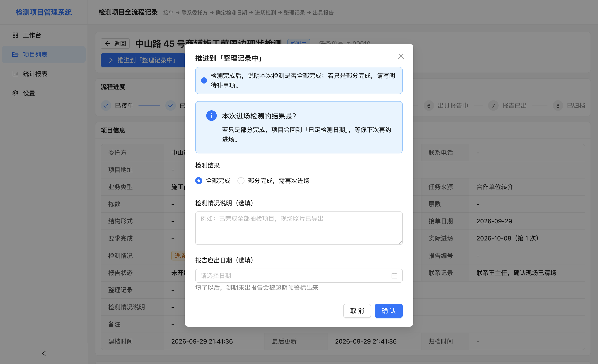
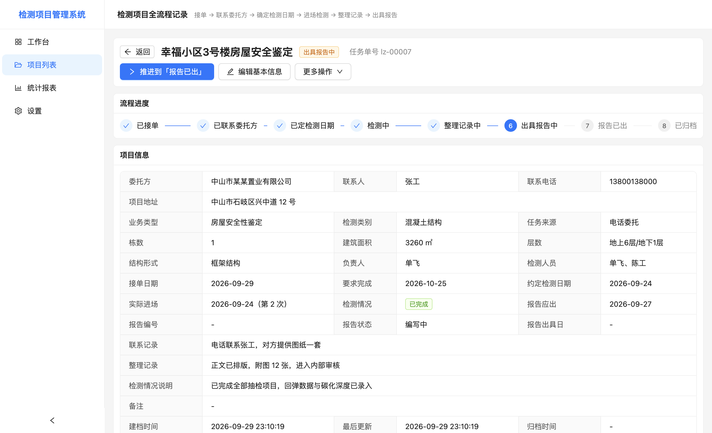
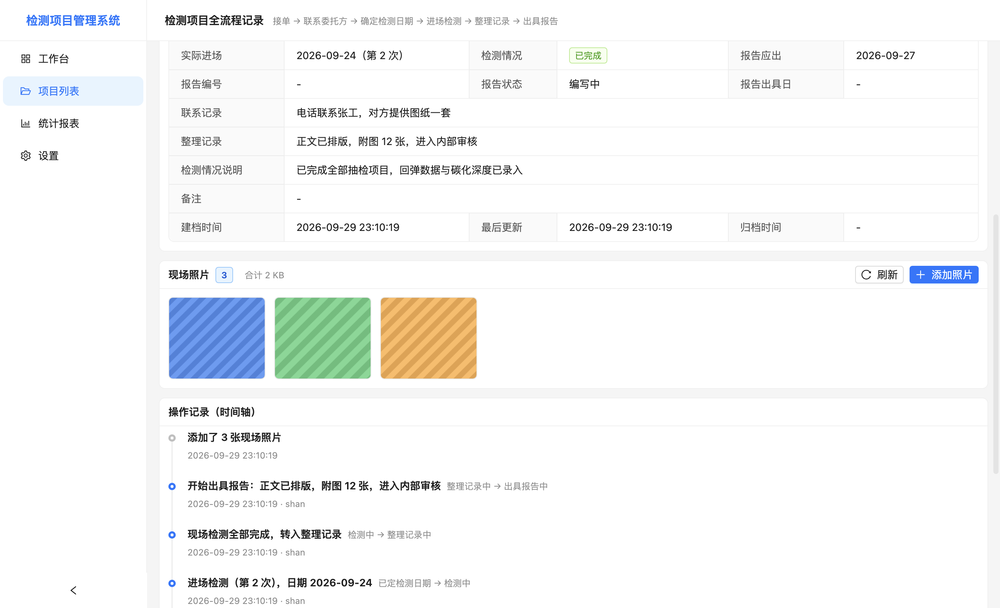
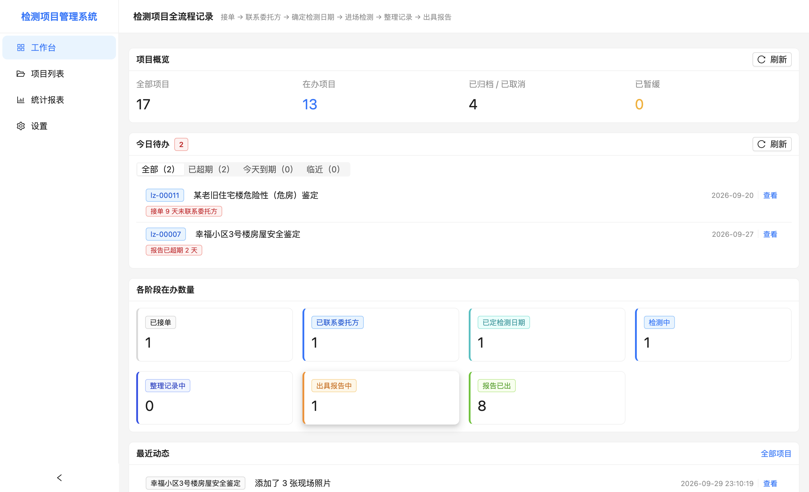
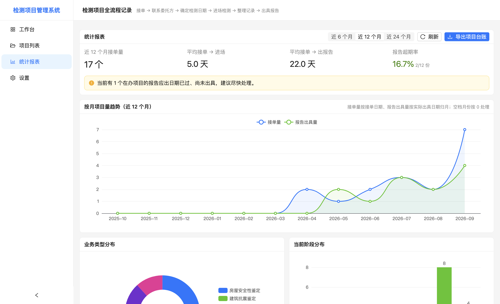
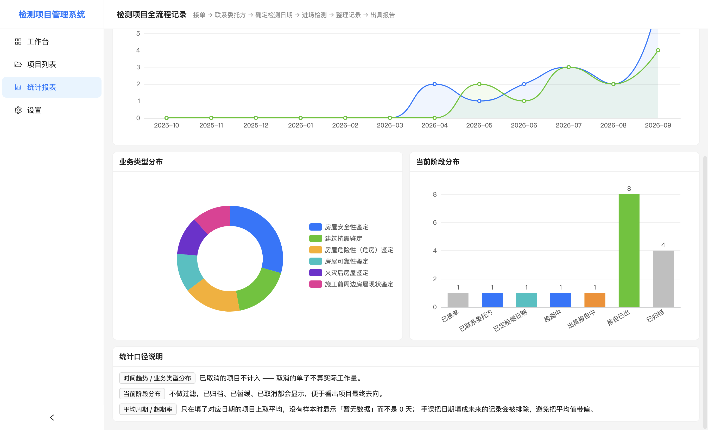
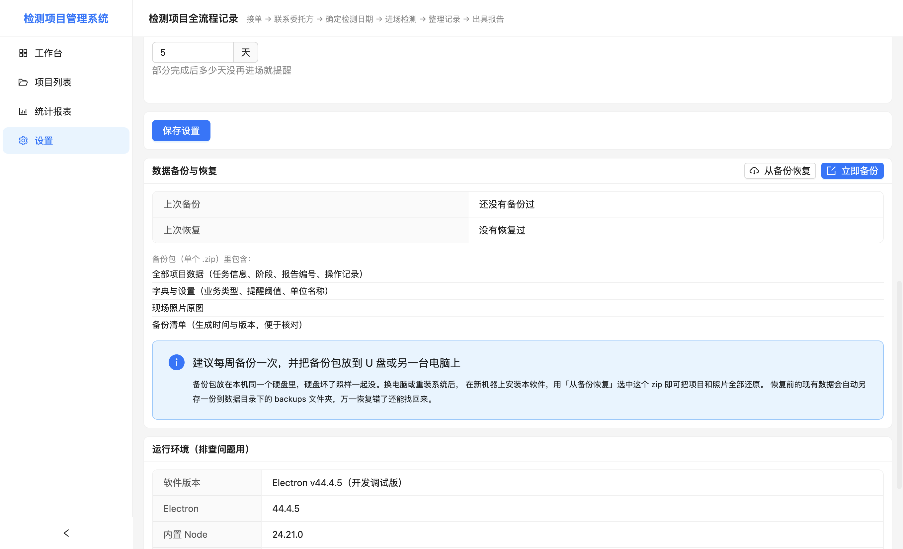

# 检测项目管理系统 —— 安装与使用说明

> 适用版本：v1.0.0（Windows 64 位）  
> 数据全部保存在本机，不联网、不上传。

---

## 一、安装

1. 拿到安装包 `检测项目管理系统-1.0.0-安装包.exe`（约 150 MB）。
2. 双击运行。

### ⚠️ 首次运行会被 Windows 拦截，这是正常的

因为软件没有购买代码签名证书，Windows 会弹出蓝底提示框：

> **Windows 已保护你的电脑**

**正确操作：点击「更多信息」→ 再点「仍要运行」。**

这不是病毒，也不是软件损坏 —— 所有个人/小团队开发、没有花钱买签名证书的软件都会这样。如果看不到「更多信息」按钮，说明这个提示框是精简模式，点左侧的「更多信息」文字即可展开。

1. 安装向导会问你装到哪个目录。默认装到当前用户目录下，**不需要管理员权限**。
2. 安装完成后，桌面和开始菜单会出现「检测项目管理系统」快捷方式。

### 卸载

从「设置 → 应用」里卸载即可。**卸载不会删除你的项目数据**，数据仍在下面的数据目录里；如果确认不再使用，可以手动删除那个文件夹。

---

## 二、数据存在哪里

```
C:\Users\<你的用户名>\AppData\Roaming\检测项目管理系统\
├── data\fwjc.db          ← 数据库（项目、操作记录、设置全在这里）
└── attachments\          ← 现场照片原图
    └── <项目>\<随机文件名>.jpg
```

- **不要把这个目录放进 OneDrive / 坚果云等网盘同步文件夹**，数据库文件在网络同步下容易损坏。
- **备份和换电脑，请用软件里的「立即备份」**（设置页），不要手工拷文件 —— 现场照片在另一个文件夹里，手工拷很容易漏掉。手工拷的话必须把 `data` 和 `attachments` **两个文件夹一起拷**。
- 软件里「设置」页可以直接看到数据文件与照片目录的真实路径。

---

## 三、日常使用流程

软件的设计思路是：**一个项目一条记录，顺着「推进到下一阶段」一步步点下去**。你不需要记状态机，只要跟着按钮走。



### 1. 新建项目

「项目列表」→ 右上角「新建项目」。



- **任务单号**：2 个小写字母 + 连字符 + 5 位数字，例如 `lz-00007`。
  - 少打连字符或大写字母，软件会自动帮你修正。
  - 重号会直接拦住并告诉你是哪个项目占用了。
  - 前缀和单位统一前缀不一致时只提醒、不拦截。
- **项目名称、委托方**是必填，其余可以留空以后再补。
- **检测人员**是自由填写的一栏，多人用顿号隔开，例如 `单飞、陈工`。写进去之后会一起出现在导出的 Excel 台账里。



### 2. 推进流程

点进项目详情页，顶部会有一个蓝色的 **「推进到「下一阶段」」** 按钮，点它、填表、确认，项目就往前走了。

| 当前阶段   | 点一下会做什么               |
| ------ | --------------------- |
| 已接单    | 记录联系委托方的情况（打给谁、说了什么）  |
| 已联系委托方 | 填与客户约定的检测日期           |
| 已定检测日期 | 填实际进场日期，系统记为「第 1 次进场」 |
| 检测中    | 选「全部完成」或「部分完成」        |
| 整理记录中  | 说明整理情况，开始编制报告         |
| 出具报告中  | 登记报告编号和出具日期           |
| 报告已出   | 归档，项目结束               |

推进「检测中」这一步时，软件会问你这次检测是全部完成还是部分完成：



### 3. 「部分完成」是怎么处理的

现场没测完（比如要搭架子、客户临时有事），在「检测中」那一步选 **「部分完成，需再次进场」**，填上还差什么，项目会回到「已定检测日期」等你约下次。再次进场后系统记为「第 2 次进场」，可以这样反复多次。项目详情页会一直显示「检测为部分完成，已进场 N 次；待补：……」



### 4. 现场照片

项目详情页中间有一块 **「现场照片」** 卡片。



- 点右上角 **「添加照片」**，可以一次选多张（JPG / PNG / HEIC 等常见格式）。
- 点击缩略图看大图，支持左右切换、缩放、旋转。
- 鼠标移到缩略图右上角的垃圾桶图标可以删掉单张。**注意：删掉的照片会同时从磁盘上删除，找不回来。**
- 照片会自动跟着「数据备份」一起打包，不用单独备份。

照片按 24 张一屏加载，后面还有就点「加载更多」。这是为了防止一个项目挂了几百张手机照把界面拖慢。

### 5. 待办提醒与超期预警

这是用来回答「我今天该盯哪几个项目」的。**工作台**上的 **「今日待办」** 卡片会把所有需要处理的项按紧急程度列出来，点一下直接进详情页；**项目列表**里对应的行左侧会带一条彩色标记条，也可以用「只看待办」筛选。



五个判断规则（阈值都能在「设置 → 提醒阈值」里改，改完立刻生效）：

| 规则      | 默认阈值 | 什么时候提醒               |
| ------- | ---- | -------------------- |
| 接单未联系   | 3 天  | 接了单超过 3 天还没联系委托方     |
| 进场日期临近  | 2 天  | 约定的检测日期快到了           |
| 报告应出提醒  | 3 天  | 填了报告应出日期，快到或已过       |
| 部分完成待跟进 | 5 天  | 上次「部分完成」后再没约下次进场     |
| 项目停滞    | 7 天  | 以上都没命中，且超过 7 天没有任何进展 |

颜色含义：**红色 = 已超期**，**橙色 = 今天到期**，**蓝色 = 即将到期**。

两种情况会被自动排除，不会来烦你：**已归档 / 已取消**的项目，以及**已暂缓**的项目（暂缓恢复后自动重新参与提醒）。

### 6. 查看历史

项目详情页底部是 **「操作记录（时间轴）」**，谁在什么时候做了什么、改了什么，全都自动记着。这是回答「这个项目几号联系的客户、几号进场的」的唯一依据，不用再翻纸质单子。添加和删除照片也会记录在这里。

### 7. 其他

- **编辑基本信息**：随时补填或修正项目资料。
- **更多操作**：暂缓项目 / 恢复推进 / 取消项目 / 删除项目。取消必须填原因。
- **搜索**：支持按任务单号、项目名称、委托方、地址、负责人模糊搜索。

---

## 四、统计报表

「统计报表」页（左侧菜单第三项）把科室情况汇总成几张图，右上角能切换「近 6 / 12 / 24 个月」。



- **四个关键数字**：这段时间接单量、平均接单→进场天数、平均接单→出报告天数、报告超期率。
- **按月项目量趋势（折线）**：蓝线是接单量、绿线是报告出具量，一眼看出今年业务是涨还是落。
- **业务类型分布（饼图）**：安全性 / 可靠性 / 危险性 / 抗震 / 施工前周边 各占多少。
- **当前阶段分布（柱状）**：项目都堆在哪一步，哪一步是瓶颈。



### 导出 Excel 台账

统计报表页右上角的 **「导出项目台账」**（项目列表页右上角也有一个）会把项目明细导成 `.xlsx`，可以直接打印或汇报。

- 从**统计报表页**导出 = 全部项目。
- 从**项目列表页**导出 = **当前筛选条件下的全部项目**（不是当前这一页）。比如筛出「报告超期」再导出，拿到的就只有这些。

导出的表里每一行是一个项目，列包含任务信息、人员、各个时间节点、当前阶段、检测情况、报告编号与状态，共 39 列；表头已冻结，第一行是单位名称和导出时间。

### 关于统计口径

- 时间趋势、业务类型分布**不计入已取消的项目** —— 取消的单子不算实际工作量。
- 当前阶段分布**不做过滤**，已归档 / 已暂缓 / 已取消都会显示，方便看项目最终去向。
- 平均周期和超期率**只在填了对应日期的项目上取平均**，没有样本时显示「暂无数据」而不是 0 天。日期填成未来的记录会被自动排除，免得把平均值带偏。

---

## 五、备份与恢复（很重要）

「设置」页最下面一块是 **「数据备份与恢复」**。



### 为什么要用软件里的备份，而不是手工拷文件

备份包是**一个 `.zip` 文件**，里面同时装了：全部项目数据、字典与设置、**现场照片原图**、以及一份备份清单（记录生成时间和内容）。用软件备份，照片就绝不会被漏掉。

### 立即备份

点「立即备份」→ 选个保存位置 → 得到一个类似 `检测项目数据备份-20261020-1530.zip` 的文件。

**建议每周备份一次，并且把 zip 放到 U 盘、移动硬盘或另一台电脑上。** 备份包存在本机同一个硬盘里，硬盘坏了照样一起没。

### 从备份恢复

点「从备份恢复」→ 选中之前导出的 zip → 软件会先把包里有什么告诉你（备份时间、包含多少张照片）→ 需要你**手动输入「恢复」两个字**才能点确定。

**恢复会覆盖当前全部项目和照片。** 所以软件在真正动手之前，会先自动把现有数据另存一份到：

```
C:\Users\<你的用户名>\AppData\Roaming\检测项目管理系统\backups\恢复前自动备份-<时间>.zip
```

万一恢复错了、后悔了，可以再拿这个文件恢复回来。恢复完成后界面会重新加载，看到的就是备份包里的数据了。

### 换电脑 / 重装系统的正确姿势

1. 旧电脑：设置页 →「立即备份」，把 zip 拷到 U 盘。
2. 新电脑：装好软件 → 设置页 →「从备份恢复」→ 选中那个 zip。
3. 项目和照片就都回来了，不需要任何手工拷贝。

---

## 六、常见问题

**Q：装完之后杀毒软件报毒？**  
关掉就好。未签名的小众软件经常被杀软误报，原因是「签名未知」而不是「行为可疑」。

**Q：能不能几个同事一起用、数据互通？**  
第一版是单机版，每人一份数据，互不影响。需要多人协作请反馈，后续可以做云端共享版本。

**Q：误删了项目怎么办？**  
删除项目会连它的操作记录和现场照片一起删掉，软件里没有回收站。但如果你有备份，可以在「设置 → 从备份恢复」里把数据找回来（注意会把整个库恢复到备份时的状态，之后新加的项目会消失）。所以请养成定期备份的习惯。

**Q：报告能自动生成吗？**  
第一版只记录报告编号和状态，报告本身还是用现有工具编写。后续可以做按模板自动生成 Word。

**Q：工作台上的「今日待办」是空的？**  
说明当前没有需要处理的项目。如果明明有项目压着却没出现，检查一下：该项目是不是「已暂缓」或「已归档」；以及「设置 → 提醒阈值」里的天数是不是设得太宽松。

**Q：为什么待办里项目的天数和我算的不一样？**  
所有天数都从「接单日期」「约定检测日期」「报告应出日期」这些**你填进去的日期**算起。如果这些日期没填，对应规则就不会触发 —— 补上日期，提醒才会准。

**Q：装完发现字体发虚 / 界面显示不全？**  
把窗口最大化，或把 Windows 的显示缩放调到 100% / 125%。软件最小窗口是 1080×700。

---

## 七、反馈

遇到问题请把「设置」页底部的 **运行环境** 一块截图发过来（里面有版本号和数据文件路径），定位问题会快很多。如果问题和某个具体项目有关，把项目详情页和它的「操作记录」一起截图更好。
